## **Documentation for Project 12**

### Refactoring our Ansible for better maintainablity and extensibility

### Creating a new directory for jenkins to save artifacts to reduce complexity

`sudo mkdir /home/ubuntu/ansible-config-artifact`

### Permission changed for jenkins to save artifacts in the new directory

`chmod -R 0777 /home/ubuntu/ansible-config-artifact`

### Copy Artifact plugin Installed on Jenkins

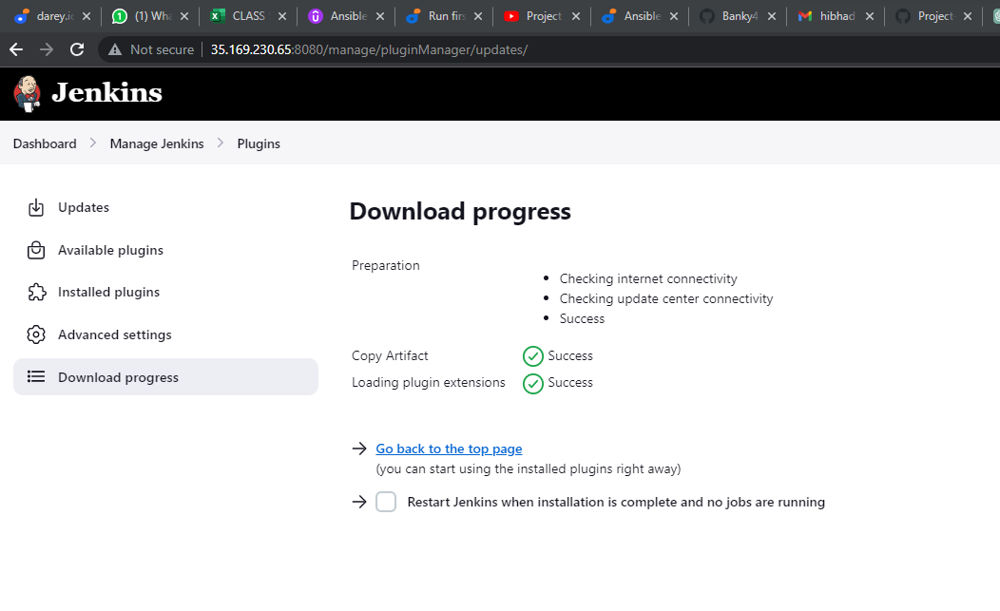

### save_artifact freestyle project created on Jenkins

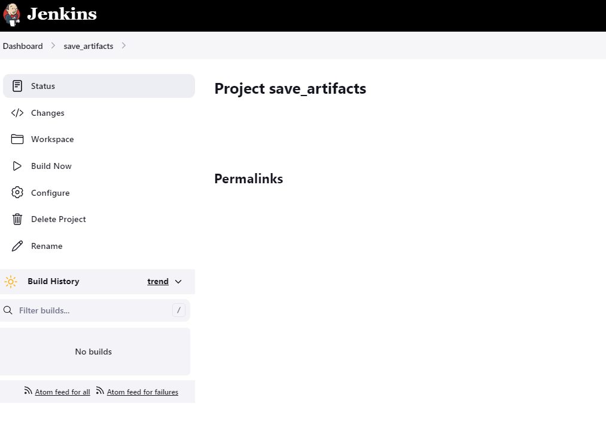

### Configuring Number of Builds to Keep and which Project to Build Artifacts from

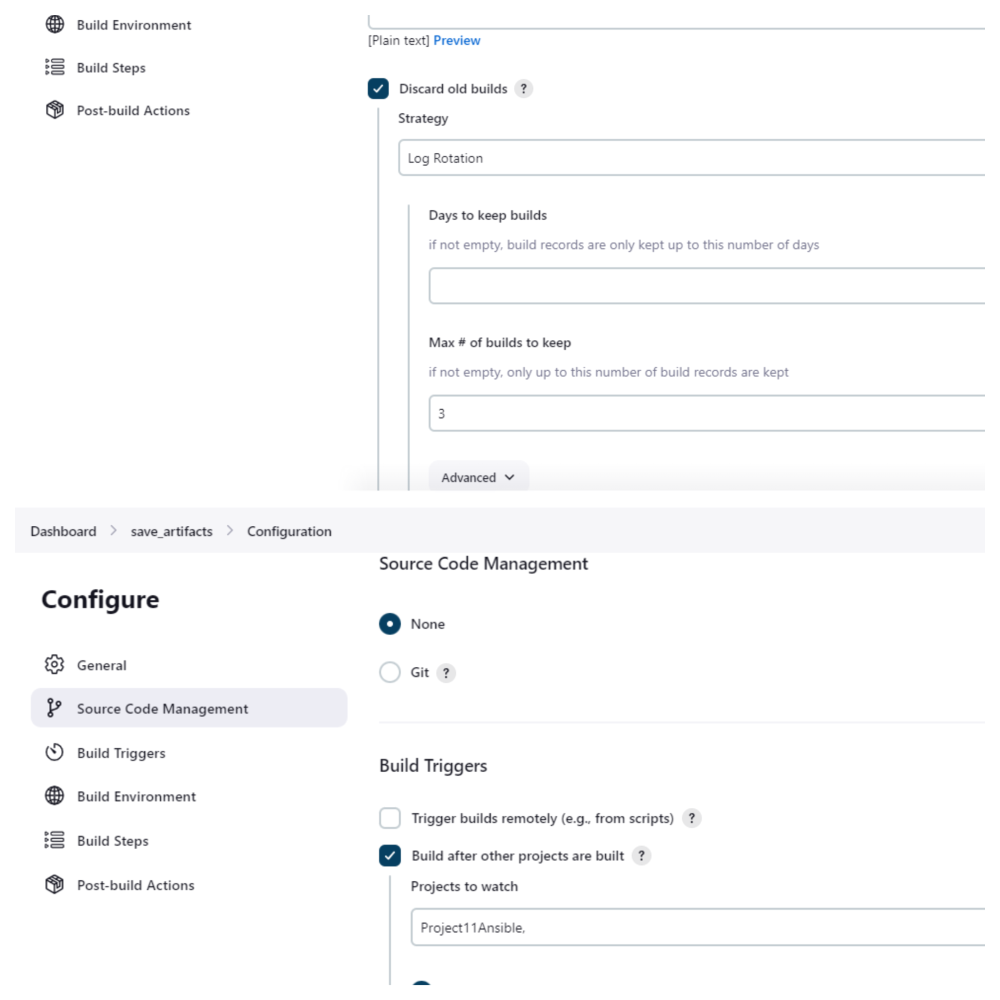

### Configuring a Build Step to copy artifact from project11ansible and Specifying the target directory which is ansible-config-artifact

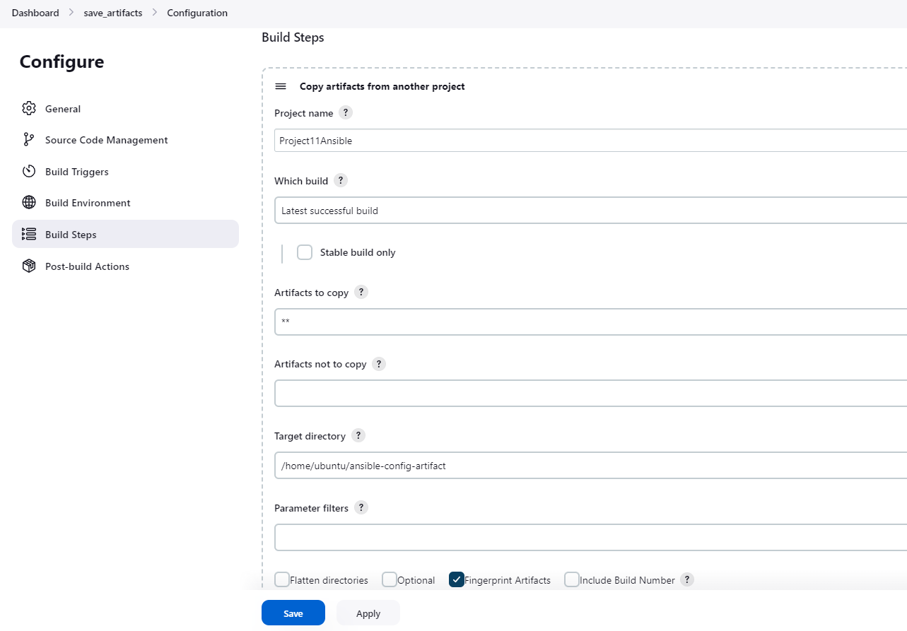

### Successfully-configured
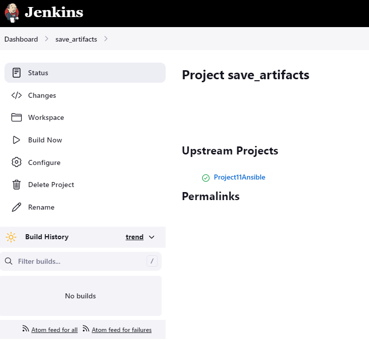

### Testing our setup by making changes to readme file
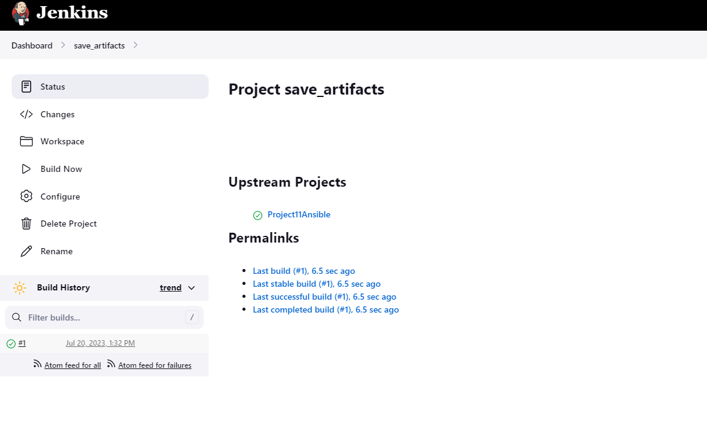

### Details of save_artifact first build in Console Output
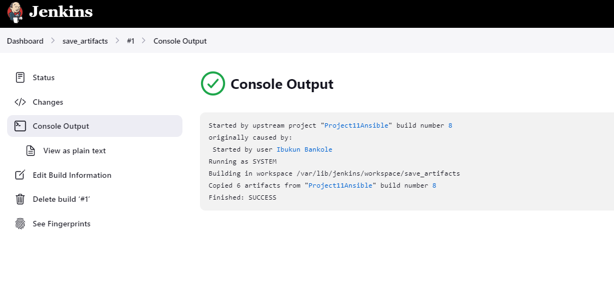

### Our Jenkins Pipeline Looking neat, and Less Complex
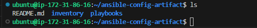

## Refactoring Ansible by Importing Playbooks for different tasks

### This is achieved by having a parent playbook named site.yml which will be used as a refference point for other playbooks (Child Playbooks)

### Our Folder structure after having our parent playbook and child playbooks

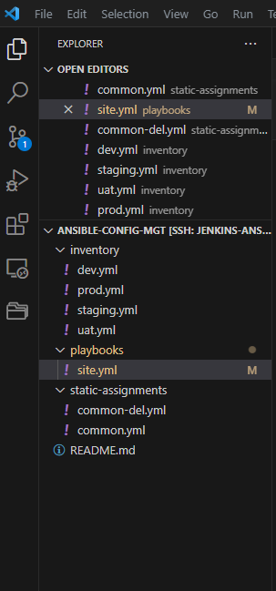

### Running our Parent playbook site.yml against our dev environment for the removal(deleting) of wireshark, making use of the built-in ansible import-playbook Module and refferencing the child playbook static-assignment/common-del.yml
` ---`
` - hosts: all `
` - import_playbook: ../static-assignments/ ` `common-del.yml `

` ansible-playbook -i inventory/dev.yml playbooks/site.yml `
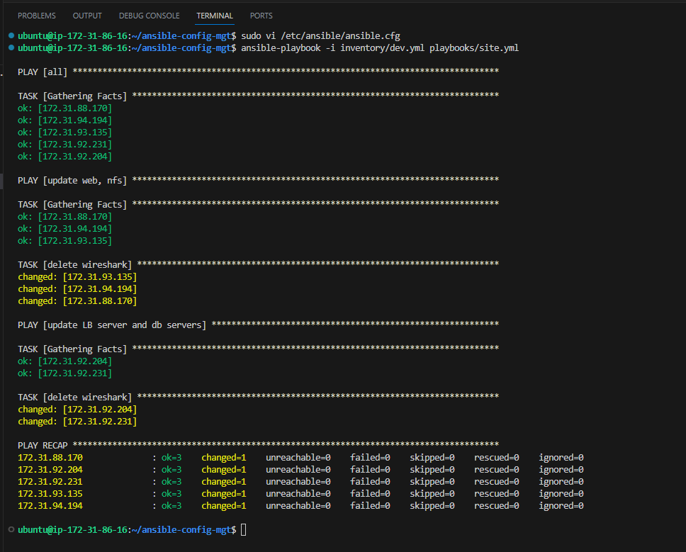

### Confirmation of removal(deleting) wireshark on all our target servers

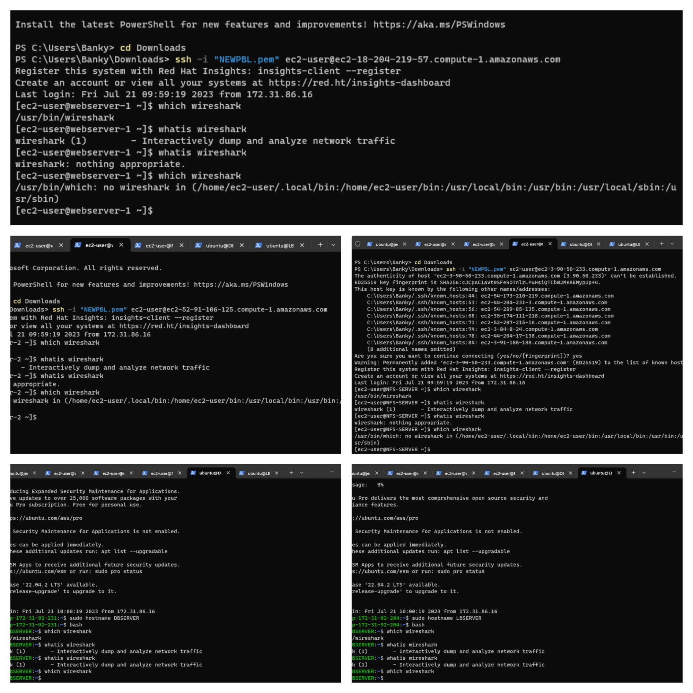