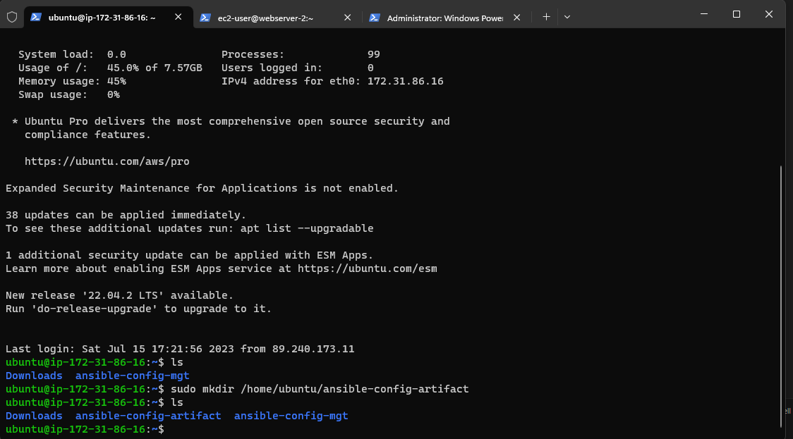
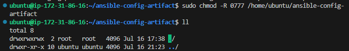

## **Documentation for Project 12**

### Refactoring our Ansible for better maintainablity and extensibility

### Creating a new directory for jenkins to save artifacts to reduce complexity

`sudo mkdir /home/ubuntu/ansible-config-artifact`

### Permission changed for jenkins to save artifacts in the new directory

`chmod -R 0777 /home/ubuntu/ansible-config-artifact`

